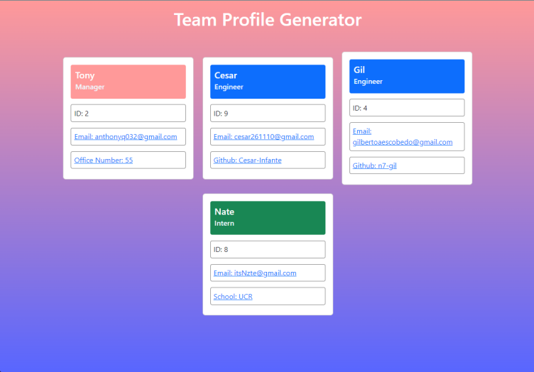
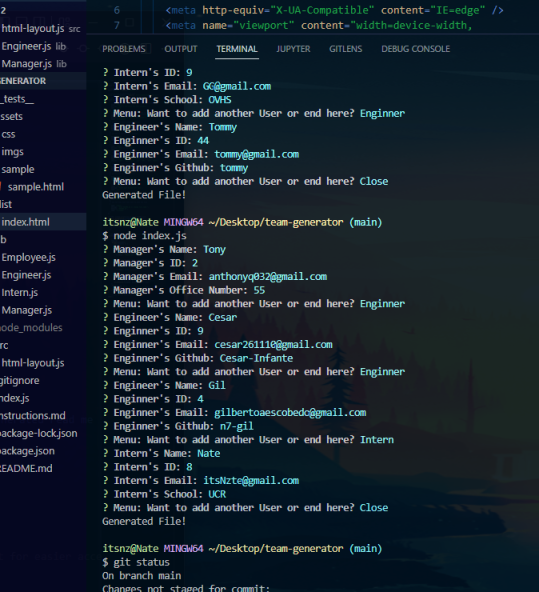

# Team Profile Generator

This is a command line application that allows the user to input data for their team which will use to create an HTML file displaying the user's team's data with neat styling. When started, prompts will appear asking the user for the manager's data first, and from there they can choose between Engineer, Intern or Done (if they they are done), and it will add that user's data as well. For each role/person they add, it will bring them back to the menu asking if they'd like to add another user or they can click done which will stop the prompts and generate the file.

[MIT](https://choosealicense.com/licenses/mit/)

## Table Of Contents

- [Usage](#usage)
- [Install](#install)
- [Contribute](#contributing)
- [Testing](#tests)
- [Licenses](#licenses)
- [Questions](#questions)

## Usage

If everything is set up correctly, then the user can start and run the application, with prompts asking the user for their team's data. The main purpose is to create a visual styled page for the user's team after they have input their team's data.

Video how to use app: https://drive.google.com/file/d/1e_oOE-y8ZqaWJIC6wUOWIJ3gARiu6NY_/view

## Install

Install Node js, and Inquirer, and run `npm start` which will run node index.js to start the application.

## Contributing

No contribution guidelines

## Tests

To run test, you can do `npm install` so they can download all the dependences in the package json file, so they can run `npm test` to test the roles.

## Questions

_Reach Out!_

Github: [TDGNate](https://github.com/TDGNate)

Email: itsNzte@gmail.com
